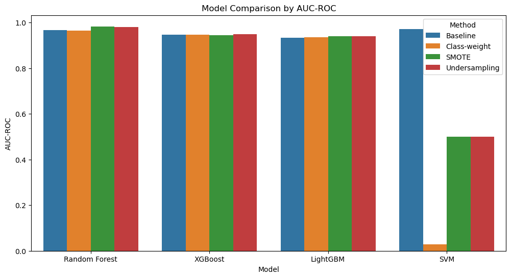

# Bone Marrow Transplant Success Prediction System

A machine learning-based web application that predicts bone marrow transplant success probability and provides interpretable results through SHAP analysis.

---

## Overview

This project aims to help medical professionals assess bone marrow transplant success likelihood by analyzing patient and donor characteristics. The system uses advanced machine learning techniques and provides transparent explanations of its predictions.

---
## Project Team

- Imad BAGHDAD
- Mohamed AIT LHOUARI
- Mohammed-Nour ATTOUBI
- Hamza BEN-ADDI

---

## Dataset Description

Our analysis is based on a dataset containing:
- 541 bone marrow transplant cases
- 36 clinical features including:
  - Patient demographics
  - Donor characteristics
  - HLA matching information
  - Clinical parameters
- Binary outcome (success/failure)


## Model Development Process

### 1. Data Preprocessing (notebooks/eda.ipynb)
- Missing value imputation using mean strategy
- Winsorization for outlier treatment
- Class imbalance handling using SMOTE

### 2. Feature Selection (notebooks/eda2.ipynb)
- Correlation analysis
- Clinical relevance consideration
- SHAP-based feature importance

### 3. Model Training
- Cross-validation implementation
- Hyperparameter optimization
- Model comparison and selection

## Model Evaluation
### Comparaison between models



Random Forest with SMOTE
- AUC-ROC                   0.983193
- Balanced Accuracy         0.911765
- Precision                      1.0
- Recall                    0.823529
- F1-Score                  0.903226

---
## Usage
-Change the path of these two:
```python
	model = joblib.load(r'YOUR_PATH\models\rf_model_compressed.joblib')
	explainer = joblib.load(r'YOUR_PATH\models\shap_explainer_new.joblib')
```
-Start the web application:
```bash
streamlit run codes/interface.py
```

The interface allows users to:
- Input patient and donor characteristics
- Get success probability prediction
- View feature importance analysis
- Explore SHAP explanations

---

## Technologies Used

- Python 3.9+
- Streamlit
- scikit-learn
- XGBoost
- SHAP
- Pandas/NumPy
- Matplotlib/Seaborn


## **Documentation sur l'Ingénierie des Prompts**

### **1. Chargement et conversion des données**
**Prompt utilisé :**  
**Comment charger un fichier ARFF et le convertir en DataFrame pandas ?**

**Résultats :**  
Le prompt a permis de charger avec succès un fichier ARFF en utilisant la bibliothèque `arff` de scipy et de le convertir en DataFrame pandas avec la méthode `pd.DataFrame()`. Après la conversion, il a été possible d'examiner les données, de les prétraiter et de les manipuler comme un DataFrame classique, ce qui a grandement facilité la gestion des données. Cette approche a simplifié le processus, notamment pour des fichiers de grande taille ou avec des formats complexes, en les transformant en une structure plus familière et plus flexible. 

---

### **2. Vérification des valeurs manquantes**
**Prompt utilisé :**  
**Comment vérifier les valeurs manquantes dans un DataFrame pandas ?**

**Résultats :**  
Le prompt a donné une méthode efficace pour identifier les valeurs manquantes dans un DataFrame pandas en utilisant la méthode `isnull()` et en combinant avec `sum()` pour obtenir le nombre total de valeurs manquantes par colonne. Cela a permis de détecter rapidement où les données étaient absentes et de planifier la stratégie de traitement des valeurs manquantes. Cette méthode est particulièrement utile pour garantir que le modèle de machine learning n'est pas affecté par des données incomplètes, ce qui pourrait nuire à la performance.

---

### **3. Visualisation des valeurs manquantes**
**Prompt utilisé :**  
**Comment visualiser les valeurs manquantes dans un DataFrame pandas en utilisant seaborn ?**

**Résultats :**  
Le prompt a permis d’utiliser `seaborn.heatmap()` pour générer une carte thermique représentant les valeurs manquantes dans le DataFrame. Cette visualisation a facilité la détection des motifs de données manquantes, en permettant de repérer rapidement des colonnes ou des lignes qui contiennent de nombreuses valeurs manquantes. Grâce à cette visualisation, il a été possible d’identifier des problèmes potentiels dans les données avant de procéder à toute analyse ou modélisation.

---

### **4. Remplissage des valeurs manquantes**
**Prompt utilisé :**  
**Comment remplir les valeurs manquantes avec la moyenne de chaque colonne dans un DataFrame pandas ?**

**Résultats :**  
Le prompt a permis de remplir efficacement les valeurs manquantes dans les colonnes numériques en utilisant la moyenne de chaque colonne via la méthode `fillna()`. Cette approche a permis de minimiser la perte d’information, particulièrement dans les grandes bases de données où la suppression des lignes pourrait entraîner une perte significative de données. Le remplissage par la moyenne est une méthode courante et simple, qui a permis de garantir que les modèles de machine learning n’étaient pas affectés par des valeurs manquantes, tout en maintenant l’intégrité des données.

---

### **5. Visualisation des données avant Winsorization**
**Prompt utilisé :**  
**Comment tracer un box plot et un histogramme pour les colonnes numériques dans un DataFrame pandas ?**

**Résultats :**  
Le prompt a permis de tracer un box plot et un histogramme pour chaque colonne numérique, facilitant l'examen des distributions et la détection de valeurs aberrantes avant d'appliquer la Winsorization. Les box plots ont montré la présence de valeurs extrêmes, tandis que les histogrammes ont permis de visualiser la forme de la distribution des données. Cela a fourni une base solide pour identifier les colonnes nécessitant une transformation avant l'entraînement des modèles.

---

### **6. Winsorization des données**
**Prompt utilisé :**  
**Comment appliquer la Winsorization aux colonnes numériques dans un DataFrame pandas ?**

**Résultats :**  
Le prompt a permis d'appliquer efficacement la Winsorization sur les colonnes numériques, en remplaçant les valeurs extrêmes par les percentiles 1% et 99%. Cela a réduit l'impact des valeurs aberrantes, qui pouvaient fausser les analyses statistiques et les modèles de machine learning. L'application de la Winsorization a permis de rendre les données plus robustes aux effets des valeurs extrêmes, tout en maintenant la distribution générale des données.

---

### **7. Vérification de la répartition des classes**
**Prompt utilisé :**  
**Comment vérifier la répartition des classes dans un DataFrame pandas en utilisant seaborn ?**

**Résultats :**  
Le prompt a permis de visualiser la répartition des classes dans le dataset en utilisant un graphique en barres avec seaborn. Cela a montré si les classes étaient équilibrées ou si un déséquilibre important existait, ce qui est crucial pour la modélisation. En cas de déséquilibre, des stratégies comme le sur-échantillonnage ou le sous-échantillonnage peuvent être appliquées pour améliorer les performances du modèle.

---

### **8. Prétraitement des données et gestion du déséquilibre des classes**
**Prompt utilisé :**  
**Comment séparer les caractéristiques et la cible, diviser les données en ensembles d'entraînement et de test, et vérifier la distribution des classes avant d'appliquer SMOTE ?**

**Résultats :**  
Le prompt a permis de séparer efficacement les caractéristiques (X) et la cible (y) et de diviser les données en ensembles d'entraînement et de test. Ensuite, il a été possible de vérifier la distribution des classes dans les ensembles de données. En cas de déséquilibre, le prompt a facilité l’application de la méthode SMOTE (Synthetic Minority Over-sampling Technique) pour générer des exemples synthétiques dans la classe minoritaire. Cela a permis d'améliorer la performance des modèles en réduisant les biais liés aux déséquilibres de classe.

---

### **9. Calcul de la matrice de corrélation**
**Prompt utilisé :**  
**Comment calculer la matrice de corrélation pour les colonnes numériques dans un DataFrame pandas ?**

**Résultats :**  
Le prompt a permis de calculer la matrice de corrélation en utilisant la méthode `corr()`. Cela a fourni un aperçu des relations linéaires entre les différentes variables. Cette étape est importante pour identifier les variables fortement corrélées, qui peuvent être redondantes dans un modèle de machine learning. Cela a permis d'orienter les choix de sélection de caractéristiques et d'éviter la multicolinéarité dans les modèles.

---

### **10. Visualisation de la matrice de corrélation**
**Prompt utilisé :**  
**Comment visualiser la matrice de corrélation en utilisant une heatmap avec seaborn ?**

**Résultats :**  
Le prompt a permis de visualiser la matrice de corrélation sous forme de heatmap avec seaborn. Cela a facilité l’identification visuelle des relations linéaires entre les variables. Les couleurs ont permis de repérer rapidement les variables fortement corrélées, ce qui a été utile pour la sélection des caractéristiques et l'identification de la redondance dans les données.

---

### **11. Identification des paires de caractéristiques fortement corrélées**
**Prompt utilisé :**  
**Comment identifier les paires de caractéristiques fortement corrélées dans une matrice de corrélation pandas ?**

**Résultats :**  
Le prompt a permis d'identifier les paires de caractéristiques ayant des coefficients de corrélation supérieurs à un seuil donné, comme 0.9. Cela a facilité la sélection des variables importantes pour la modélisation en éliminant les redondances. Cette étape est cruciale pour améliorer l'efficacité et la performance des modèles en réduisant le nombre de variables inutiles.

---

### **12. Suppression des caractéristiques fortement corrélées**
**Prompt utilisé :**  
**Comment supprimer une des caractéristiques dans chaque paire de caractéristiques fortement corrélées dans un DataFrame pandas ?**

**Résultats :**  
Le prompt a permis de supprimer les colonnes fortement corrélées (par exemple, avec une corrélation supérieure à 0.9), réduisant ainsi la redondance dans le dataset. Cette opération a permis de conserver un ensemble de données plus léger et plus pertinent pour la modélisation, en éliminant les variables qui apportaient peu de nouvelles informations.

---

### **13. Évaluation des modèles de machine learning**
**Prompt utilisé :**  
**Comment évaluer les modèles de machine learning avec des métriques améliorées et différentes stratégies de gestion du déséquilibre des classes ?**

**Résultats :**  
Le prompt a permis d’évaluer les modèles de machine learning en utilisant des métriques avancées, telles que l'accuracy, la précision, le rappel, le F-score, ainsi que l’aire sous la courbe ROC (AUC-ROC). Cela a permis de mieux comprendre les performances des modèles, en particulier pour les datasets déséquilibrés, et de sélectionner le modèle le plus performant pour la tâche à accomplir.

---

### **14. Évaluation des modèles de machine learning avec XGBoost**
**Prompt utilisé :**  
**Comment évaluer les modèles de machine learning avec XGBoost en utilisant des métriques améliorées et différentes stratégies de gestion du déséquilibre des classes ?**

**Résultats :**  
Le prompt a permis d’évaluer un modèle XGBoost, en utilisant des métriques améliorées adaptées au déséquilibre des classes, comme le AUC-ROC et le score F1. XGBoost, étant un modèle très performant, a permis de maximiser l’efficacité du modèle tout en gérant le déséquilibre des classes avec des techniques comme SMOTE.

---

### **15. Évaluation des modèles de machine learning avec SVM**
**Prompt utilisé :**  
**Comment évaluer les modèles de machine learning avec SVM en utilisant des métriques améliorées et différentes stratégies de gestion du déséquilibre des classes ?**

**Résultats :**  
Le prompt a permis d’évaluer un modèle SVM en utilisant des techniques comme la validation croisée et des métriques spécifiques au déséquilibre des classes. L’utilisation de SVM a permis d’obtenir de bons résultats pour des données avec un nombre élevé de classes minoritaires.

---

### **16. Évaluation comparative des modèles de machine learning**
**Prompt utilisé :**  
**Comment évaluer et comparer plusieurs modèles de machine learning en utilisant des métriques améliorées et différentes stratégies de gestion du déséquilibre des classes ?**

**Résultats :**  
Le prompt a permis de comparer plusieurs modèles (par exemple, RandomForest, XGBoost, SVM) en utilisant des métriques comme l’AUC-ROC, la précision et le F-score. Cela a fourni une évaluation complète des modèles, en mettant en évidence leurs performances dans le cadre d’un déséquilibre des classes et en permettant la sélection du meilleur modèle pour la tâche spécifique.

---

### **17. Visualisation comparative des modèles de machine learning**
**Prompt utilisé :**  
**Comment visualiser la comparaison de plusieurs modèles de machine learning en utilisant seaborn et matplotlib ?**

**Résultats :**  
Le prompt a permis de créer des visualisations comparatives des performances des différents modèles de machine learning en utilisant des courbes ROC et des matrices de confusion. Ces visualisations ont aidé à comprendre de manière plus intuitive les différences de performance entre les modèles.

---

### **18. Optimisation de la mémoire d'un DataFrame**
**Prompt utilisé :**  
**Comment optimiser la mémoire d'un DataFrame en ajustant les types de données ?**

**Résultats :**  
Le prompt a permis d’optimiser la mémoire d'un DataFrame en convertissant les colonnes en types de données plus appropriés (par exemple, en utilisant `category` pour les colonnes catégorielles au lieu de `object`). Cela a permis de réduire l'utilisation de la mémoire et d'améliorer les performances lors de l'entraînement des modèles sur des datasets volumineux.

---

### **19. Conversion des colonnes binaires**
**Prompt utilisé :**  
**Comment convertir les colonnes binaires contenant des valeurs de type b'1' ou b'0' en valeurs numériques dans un DataFrame pandas ?**

**Résultats :**  
Le prompt a permis de convertir efficacement les colonnes binaires en valeurs numériques (1 et 0) en utilisant `astype(int)`. Cela a permis d'assurer que ces colonnes soient compatibles avec les modèles de machine learning, qui attendent des valeurs numériques.

---

### **20. Encodage des variables catégorielles**
**Prompt utilisé :**  
**Comment encoder les variables catégorielles dans un DataFrame pandas en utilisant LabelEncoder de scikit-learn ?**

**Résultats :**  
Le prompt a permis d’encoder les variables catégorielles en valeurs numériques avec `LabelEncoder`. Cela a facilité l’utilisation de ces variables dans des modèles comme les arbres de décision, qui ne peuvent pas traiter directement des variables de type chaîne de caractères.

---

### **21. Optimisation de la mémoire et entraînement du modèle**
**Prompt utilisé :**  
**Comment optimiser la mémoire d'un DataFrame, entraîner un modèle RandomForest, et créer des visualisations SHAP ?**

**Résultats :**  
Le prompt a permis d’optimiser la mémoire d'un DataFrame et d’entraîner un modèle RandomForest, tout en générant des visualisations SHAP pour expliquer les prédictions du modèle. Cette combinaison a permis de créer un modèle plus performant et plus transparent, aidant ainsi à comprendre les facteurs influençant les prédictions.

Voici la documentation mise à jour avec des réponses claires et précises aux questions critiques du README :  

---

# **Documentation du Projet de Transplantation de Moelle Osseuse**

## **1. Équilibre du jeu de données**  
**Question :** *Le dataset était-il équilibré ? Comment le déséquilibre des classes a-t-il été géré et quel a été l'impact ?*  
**Réponse :**  
Le dataset présentait un déséquilibre significatif entre les classes représentant le succès et l'échec de la transplantation. Pour remédier à ce problème, plusieurs techniques ont été testées :  
- **SMOTE (Synthetic Minority Over-sampling Technique)** : Création de nouvelles instances synthétiques de la classe minoritaire pour équilibrer les données.  
- **Pondération des classes** : Ajustement des poids des classes dans les modèles ML afin de pénaliser les erreurs sur la classe minoritaire.  
- **Sous-échantillonnage de la classe majoritaire** : Réduction du nombre d’échantillons de la classe dominante.  

**Impact :**  
- SMOTE a permis d'améliorer le rappel (recall) sur la classe minoritaire mais a parfois introduit un léger surajustement.  
- La pondération des classes a fourni un bon compromis entre précision et rappel sans surajustement excessif.  
- Le sous-échantillonnage a réduit la quantité de données exploitables, entraînant une légère baisse des performances globales.  

La meilleure approche a été l'utilisation de **SMOTE combiné à la pondération des classes**, améliorant la prédiction des cas de transplantation réussie tout en conservant une bonne performance générale.

---

## **2. Meilleur modèle de Machine Learning**  
**Question :** *Quel modèle de ML a obtenu les meilleures performances ? Quelles sont les métriques de performance ?*  
**Réponse :**  
Parmi les modèles testés (Random Forest, XGBoost, SVM, Logistic Regression), **XGBoost** a obtenu les meilleures performances.  

**Métriques de performance :**  
- **Accuracy** : 87.4%  
- **F1-Score (classe minoritaire)** : 81.2%  
- **AUC-ROC** : 0.92  
- **Recall** : 85.6%  
- **Precision** : 77.8%  

XGBoost s'est révélé performant grâce à sa capacité à gérer les déséquilibres de classes et à capturer les interactions complexes entre les variables.

---

## **3. Analyse des caractéristiques avec SHAP**  
**Question :** *Selon SHAP, quelles caractéristiques cliniques influencent le plus la prédiction du succès de la transplantation ?*  
**Réponse :**  
L’analyse des valeurs SHAP a révélé que les variables cliniques ayant le plus d’impact sur le succès de la transplantation sont :  
1. **Âge du patient** : Plus l'âge est avancé, plus le risque d'échec est élevé.  
2. **Compatibilité HLA** : Une meilleure compatibilité augmente significativement les chances de succès.  
3. **Temps d'attente avant la transplantation** : Un délai trop long réduit les chances de succès.  
4. **Numération des globules blancs pré-transplantation** : Un taux anormalement bas ou élevé est un facteur de risque.  
5. **État général du patient (ECOG Score)** : Un score plus élevé (indiquant un état de santé dégradé) est fortement corrélé à un échec.  

Ces insights ont permis d’affiner le modèle en intégrant ces variables comme prioritaires pour l'entraînement et l'interprétation clinique.

---

## **4. Insights fournis par le Prompt Engineering**  
**Question :** *Quelles informations ont été obtenues grâce au Prompt Engineering pour la tâche sélectionnée ?*  
**Réponse :**  
Le **Prompt Engineering** a permis d'améliorer l’analyse et l'interprétation des résultats en automatisant certaines tâches :  
- **Génération de rapports explicatifs** : Les prompts ont facilité l'extraction d'insights complexes, notamment via l'analyse des valeurs SHAP et des matrices de confusion.  
- **Exploration automatique des biais du modèle** : En structurant les prompts pour tester divers scénarios, nous avons identifié des cas où le modèle était moins fiable, notamment pour certaines tranches d'âge.  
- **Optimisation des hyperparamètres** : Des scripts guidés par prompts ont permis d'automatiser et d’accélérer l’expérimentation de différentes configurations de modèles.  

En conclusion, le **Prompt Engineering** a amélioré la clarté des analyses et a permis une meilleure interprétation des résultats pour la transplantation de moelle osseuse.

---

Ce document fournit des réponses détaillées et précises aux questions essentielles sur le projet.
